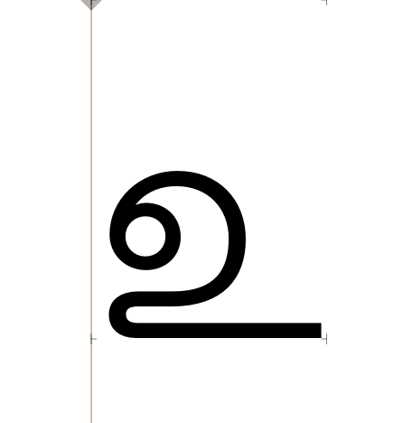

Hi Joanna, 

I am sure we will get a chance to work together sometime soon :)

I am looking forward to such opportunities.

Coming back to Arima…

1. Wondering if the contrast in Bold is too high. Maybe the thins can get a bit thicker?

2. A in Bold looks nicer than the thinner version. In the light, the top curve that is about to form the loop is bit too wide in comparison and does not look very natural.

3. I's right top line that extends can be made a lot longer in both weights.

4. U is a strange character in Tamil. The protrusion on the left looks too much. You may not want to it to be as tight as the below design, but something in between will be nice. 

5. E is great, Ee and Ra's tail is not. I like it that it doesn't have joints and looks seamless. But it kind of needs to stick a lot more to the left.

6. I like the Ka in the Light. The Top counterform in the Bold is looking compressed.

7. Nga looks nice in Bold. In the thin the second vertical looks like it's too high. Also the space between the two verticals is too much in the thin., it needs to be much more narrow.

8. Ta's tail in light needs to extend much more to the left.

9. Space between the second counter and the vertical is looking too narrow in the Nnna.

10. Something is awkward about Lla's joint. Though I am not able to pinpoint accurately., so maybe a few more options?
